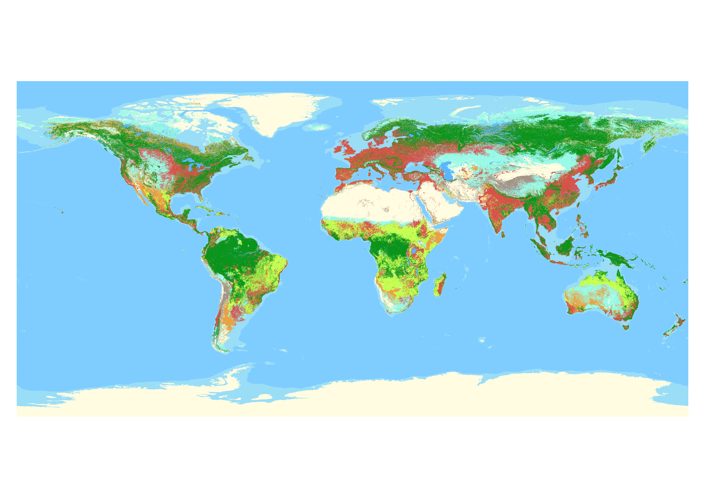
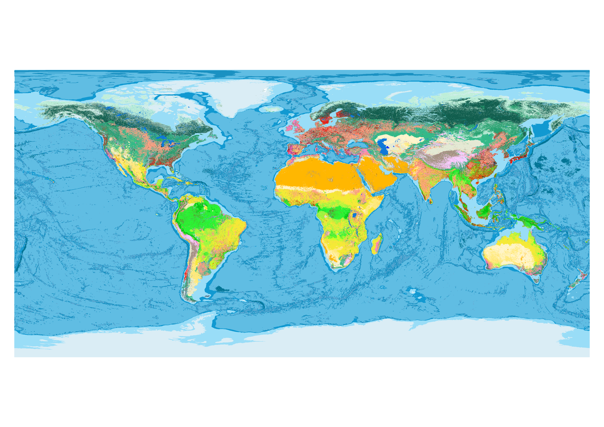

# Habitatmapping
Repository for creating a habitat type map in [Google Earth Engine](https://earthengine.google.com/).

The code and map is released under a GNU GPL 3.0 license and thus can be freely shared, used or modified.
The most recent version of the habitat type layer will be contained in this repository and assigned a Zenodo version number

To run the code for creating the habitat type map an account on Google Earth Engine is necessary. No Python code was developed as part of this project. Note that while the code for the habitat type map is openly available, the underlying datasets ('assets' in Google Earth Engine) are not all (yet) publicly available. Assets can be shared depending on the request, however there is no guarantee that I will host all original input assets for long, since they might change as improved data becomes available.

## Suggested citation:

Jung et al. XXX

<ZENODO>

## Example screenshots

Visualization styles files (qml and clr) can be found in the styles folder.

**Level1**

**Level2**

